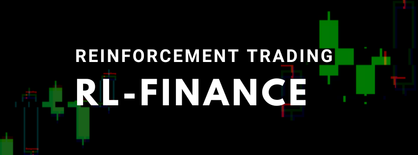
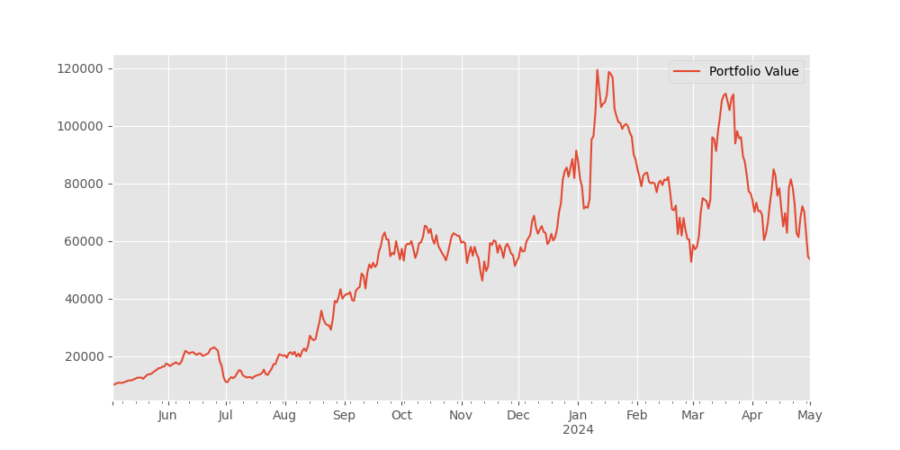

# A Reinforcement Learning pipeline for Algorithmic Trading #

This repository provides the environment used to train an Algorithmic Trading agent for dynamic exploration of the market using Reinforcement Learning.


**Maintainer**: Trung Dang\
**Affiliation**: University of Massachusetts Amherst\
**Contact**: trungdangminh14012004@gmail.com\
**Academic Inquiries**: tmdang@umass.edu

---

## Useful Links ##

- Project website: [To Update]
- `rsl_rl` (PPO code structure): https://github.com/leggedrobotics/rsl_rl


## Installation ##
1. Create a new python virtual env with python 3.8 or above
2. Install pytorch 1.10 with cuda-11.3:
    - `pip3 install torch==1.10.0+cu113 torchvision==0.11.1+cu113 torchaudio==0.10.0+cu113 -f https://download.pytorch.org/whl/cu113/torch_stable.html`
3. Install dependencies with either `requirements.txt` or `setup.py`
    - `pip install -r requirements.txt`
    - `python3 setup.py`

## CODE STRUCTURE ##
This code structure is adapted from [leggedrobotics\legged_gym](https://github.com/leggedrobotics/legged_gym)
1. Each environment is defined by an env file (`trader.py`) and a config file (`trader_config.py`). The config file contains two classes: one containing  all the environment parameters (`TraderCfg`) and one for the training parameters (`TraderCfgPPO`).  
2. Both env and config classes use inheritance.  
3. Each non-zero reward scale specified in `cfg` will add a function with a corresponding name to the list of elements which will be summed to get the total reward.  
4. Tasks must be registered using `task_registry.register(name, EnvClass, EnvConfig, TrainConfig)`. This is done in `envs/__init__.py`, but can also be done from outside of this repository.  

## Usage ##
1. Train:  
  ```python legged_gym/scripts/train.py --task=trader```
    -  To run on CPU add following arguments: `--sim_device=cpu`, `--rl_device=cpu` (sim on CPU and rl on GPU is possible).
    - The trained policy is saved in `rl_finance/logs/<experiment_name>/<date_time>_<run_name>/model_<iteration>.pt`. Where `<experiment_name>` and `<run_name>` are defined in the train config.
    -  The following command line arguments override the values set in the config files:
     - --task TASK: Task name.
     - --resume:   Resume training from a checkpoint
     - --experiment_name EXPERIMENT_NAME: Name of the experiment to run or load.
     - --run_name RUN_NAME:  Name of the run.
     - --load_run LOAD_RUN:   Name of the run to load when resume=True. If -1: will load the last run.
     - --checkpoint CHECKPOINT:  Saved model checkpoint number. If -1: will load the last checkpoint.
     - --num_envs NUM_ENVS:  Number of environments to create.
     - --seed SEED:  Random seed.
     - --max_iterations MAX_ITERATIONS:  Maximum number of training iterations.
2. Play a trained policy:  
```python rl_trader/scripts/play.py --task=trader```
    - By default, the loaded policy is the last model of the last run of the experiment folder.
    - Other runs/model iteration can be selected by setting `load_run` and `checkpoint` in the train config.

## Adding a new environment ##
The default environment `main` is equipped with the agent that performs basic trading operations. `TraderCfg` and `TraderCfgPPO` should be parent class for all the new environment `cfg` files. To add a new environment:

1. Add a new folder to `envs/` with `'<your_env>_config.py`, which inherit from an existing environment cfgs  
2. (If needed) implement your environment in <your_env>.py, inherit from an existing environment (`Trader`), overwrite the desired functions and/or add your reward functions.
3. Register your env in `rl_trader/envs/__init__.py`.
4. Modify/Tune other parameters in your `cfg`, `cfg_train` as needed. To remove a reward set its scale to zero. Do not modify parameters of other envs!


## Troubleshooting ##
1. If you get the following error: `ImportError: libpython3.8m.so.1.0: cannot open shared object file: No such file or directory`, do: `sudo apt install libpython3.8`. It is also possible that you need to do `export LD_LIBRARY_PATH=/path/to/libpython/directory` / `export LD_LIBRARY_PATH=/path/to/conda/envs/your_env/lib`(for conda user. Replace /path/to/ to the corresponding path.).

## Preliminary Results ##
`Trader` trained on 10 years data from 2013 to 2023 with 12 stocks : `['AAPL', 'MSFT', 'AMZN', 'GOOGL', 'META', 'NVDA', 'TSLA', 'AVGO', 'ORCL', 'TSM','ASML', 'TCEHY']` yielded approximately 18% Return from Jan 2024 to Jul 2024.



## Future Directions
- [ ] Adding reward functions and financial theories.
- [ ] Adding sentiment analysis and more complex observations.
- [ ] Framework for Intraday Trading.
- [ ] Integrate into broker services or simulators.